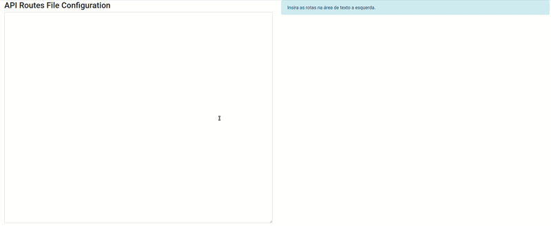

# Ct-Api-Gateway-Deployer-Visualizer

This is a simple visualizer tool to see the api routes file configuration of format of the project [ct-api-gateway-deployer](https://pypi.org/project/ct-api-gateway-deployer/).

You don't need install this tool. You should using through the link [Ct-Api-Gateway-Deployer-Visualizer Link](https://bernardoow.github.io/ct-api-gateway-deployer-visualizer/).

## Example

